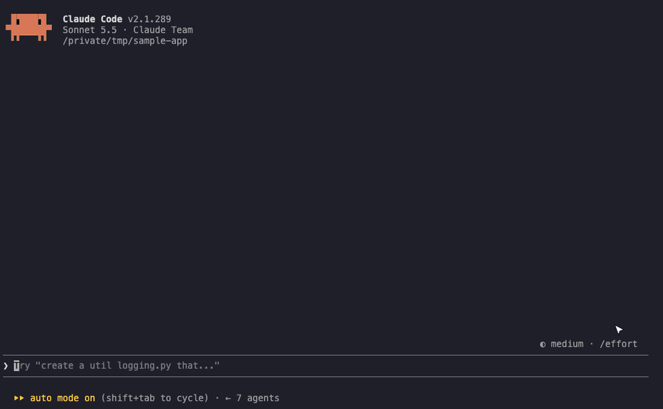
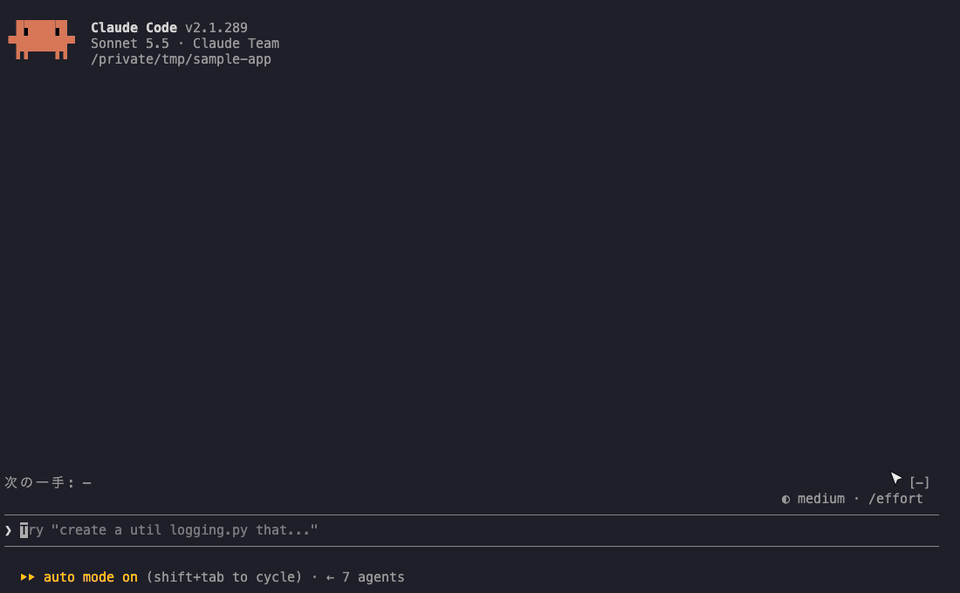
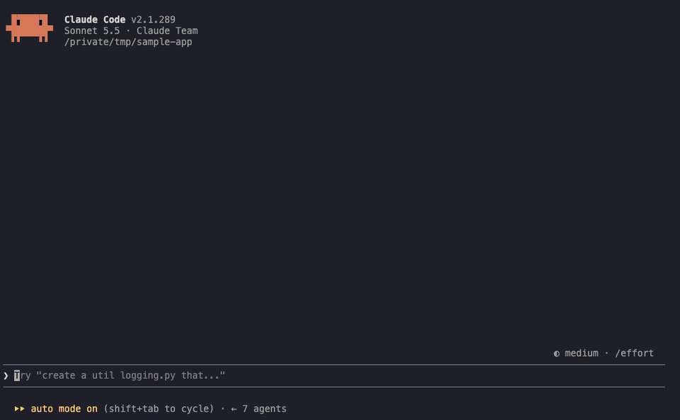
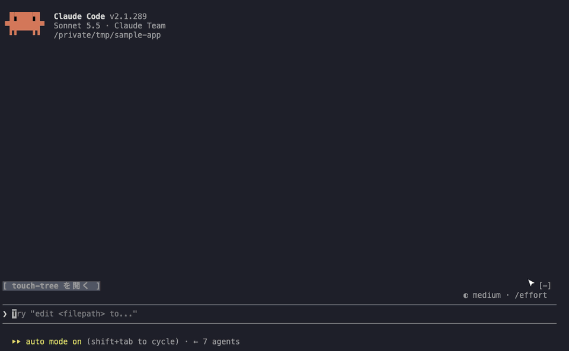
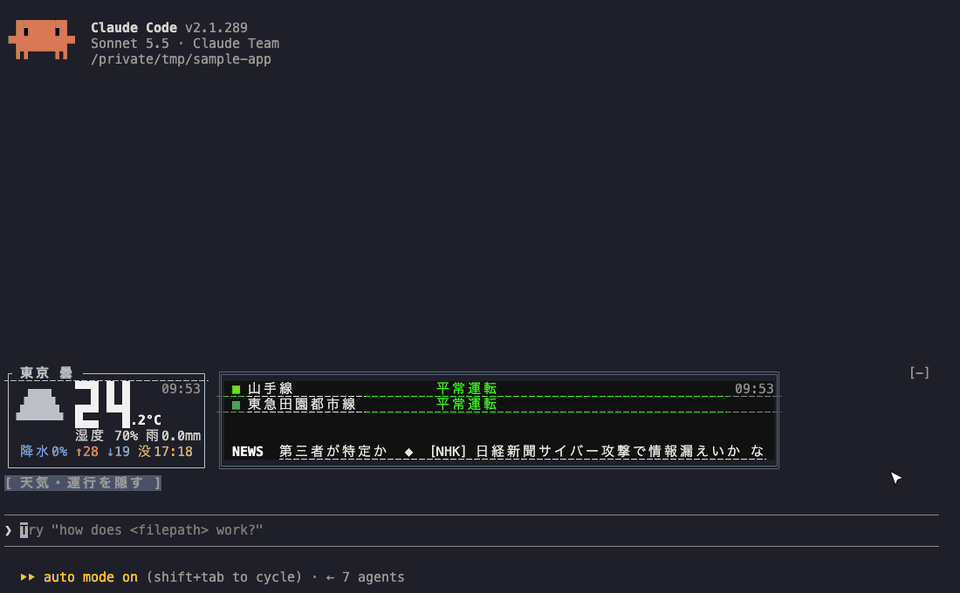
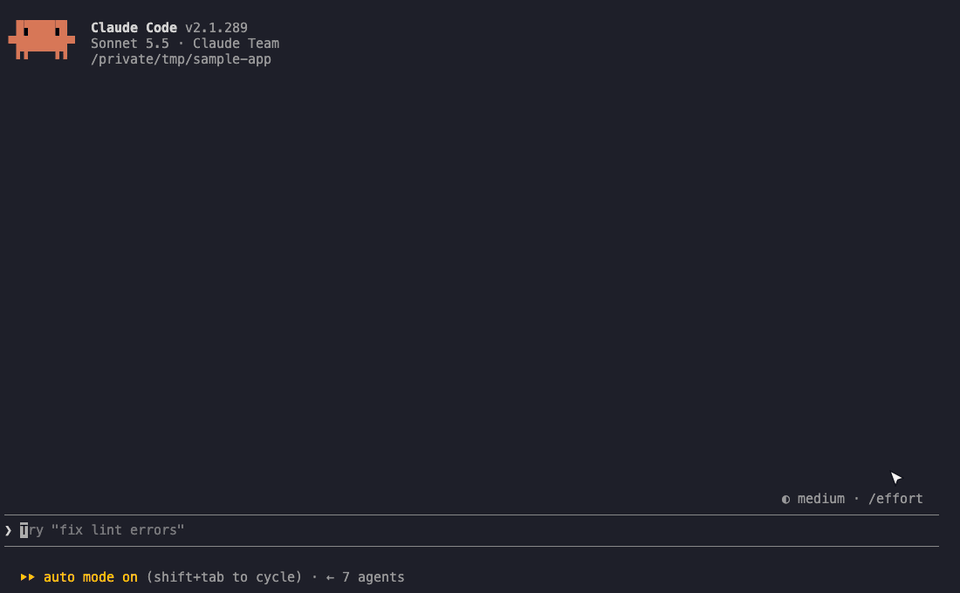

# y-ymmt-harnesses

Claude Code 用のプラグイン（marketplace）。

| プラグイン | 内容 |
|---|---|
| `turn-counter` | 作業中のスピナーをこのセッションのターン数（`ターン 12`）に差し替える。ツール拒否で「ざわっ！」を一瞬出す |
| `tokyo-board` | 17:00〜24:00 の間、プロンプト上の帯に東京の天気・運行情報（電光掲示板風）・警報・IT/AI ニュースを出す |
| `touch-tree` | このセッションで Claude が読んだ・編集したファイルを、リポジトリのツリーに沿ってペインに出す（`/touch-tree`） |
| `next-prompts` | ターンが終わるたびに、次に打ちそうな依頼の候補（haiku が会話から作る）をプロンプトの上にボタンで並べる。押すとその文が入力欄に入る（送信はしない） |
| `reply-prism` | 返事の表・コード・Mermaid の図・ツール行を色つきで描き直す（[prismantis](https://github.com/NahumLitvin/prismantis) の改変版）。パスをクリックでエディタで開く、表を Markdown・TSV・Slack 形式でコピー・列で並べ替え、長い表とコードを畳む、`本番` `DELETE` などを赤背景で目立たせる（`/reply-prism`） |
| `prompt-trail` | このセッションで打ったプロンプトを帯の棒の列（または縦のペイン）に並べ、ホバーで読み・クリックでその位置へ飛ぶ（[prompt-rail](https://github.com/oikon48/prompt-rail) の改変版）。`[ 入力欄へ ]` `[ コピー ]` で再利用、棒の下の色でそのターンの結果（編集・失敗・拒否・中断）が分かる（`/prompt-trail`） |

いずれも function hooks（Mods）で作っている。Claude Code 2.1.287 以降は追加の設定なしで動く。

## 見た目

実際の Claude Code で撮ったもの（撮り方は [demo/README.md](demo/README.md)）。

### reply-prism

表の返事を、見出しの ⇅ で並べ替える。



### next-prompts

返事のあとに次の一手の候補が並び、`/1` と空白で 1 つ目を入力欄に入れる。



### prompt-trail

打ったプロンプトが帯の棒に並ぶ。棒にホバーしてカードを読み、`[ 入力欄へ ]` で打ち直す。



### touch-tree

読んだ・編集したファイルが、リポジトリのツリーに沿ってペインに並ぶ。



### tokyo-board

天気パネルと電光掲示板（運行情報・ニュース）。



### turn-counter

作業中のスピナーが、このセッションの何ターン目かに変わる。



## 入れ方

```sh
claude plugin marketplace add y-ymmt/y-ymmt-harnesses
claude plugin install turn-counter@y-ymmt-harnesses
claude plugin install tokyo-board@y-ymmt-harnesses
claude plugin install touch-tree@y-ymmt-harnesses
claude plugin install next-prompts@y-ymmt-harnesses
claude plugin install reply-prism@y-ymmt-harnesses
claude plugin install prompt-trail@y-ymmt-harnesses
```

各プラグインの設定と仕組みは `plugins/<name>/README.md` を参照。

## 動作環境と確かめた範囲

作者が実機で確かめたのは **macOS・端末 Orca・Claude Code の全画面表示（fullscreen）・Claude Code 2.1.289** の組み合わせだけ。
それ以外は、コードを読んでの見立てか、偽の `$` を使ったテストまで。各プラグインの表は次の節にある。

- [turn-counter](plugins/turn-counter/README.md#動作環境と確かめた範囲)
- [tokyo-board](plugins/tokyo-board/README.md#動作環境と確かめた範囲)
- [touch-tree](plugins/touch-tree/README.md#動作環境と確かめた範囲)
- [next-prompts](plugins/next-prompts/README.md#動作環境と確かめた範囲)
- [reply-prism](plugins/reply-prism/README.md#動作環境と確かめた範囲)
- [prompt-trail](plugins/prompt-trail/README.md#動作環境と確かめた範囲)

表の「状態」の意味:

| 状態 | 意味 |
|---|---|
| 確認済み | 作者の環境で実際に使って確かめた |
| たぶん動く | その環境に依るコードが無いので動くと見ているが、実機では見ていない |
| 未確認 | 動くかどうかコードからは決められず、試してもいない |
| 未対応 | 動かない、またはわざと何もしない（その理由は補足に書く） |

どのプラグインにも共通すること:

- **表示の言葉は日本語だけ**。英語などへの切り替えは無い
- **クリック**: ボタンをクリックで押せるのは全画面表示の端末だけ（Claude Code がクリックを Mod に渡すのはそのときだけ）。
  全画面表示でないときは ctrl+x tab でボタンのある場所に移り、Tab と Enter で押す
- **リンク**: Orca の全画面表示では、`Link` の `https://` はクリックで開いたが、`vscode://` はクリックでも cmd+クリックでも開かなかった。
  そのため touch-tree と reply-prism は、ボタンを押すと `open`（無ければ `xdg-open`）に URL を渡して開くようにしている。
  **Windows 用の開き方は無い**
- **文字の幅**: 全角は 2 桁、罫線や `●` `■` `▲` などは 1 桁として桁を揃えている。曖昧な幅の文字を 2 桁で描く設定の端末では桁がずれる（推測）
- **表示面**: 帯・スピナー・リンクは端末（`e.surface === 'terminal'`）を前提にしている。デスクトップアプリ・VS Code 拡張・モバイルでの見た目は作者は確かめていない
- **Claude Code の版**: 確かめたのは 2.1.289。2.1.281 では帯のボタンの当たり判定がずれる不具合が出たことがあり、
  帯にあった Clawd の `Client` 要素を消すと直った。原因は分かっていない

## プロンプト上の帯の表示順

`tokyo-board`・`touch-tree`・`prompt-trail`・`next-prompts` は、プロンプトの上の帯（`AbovePrompt`）を共有して描く。
4 つとも入れたときは、読み込み順に関係なく次の並びになる（括弧は `hooks/band.ts` の `BAND_ORDER` の値）。

```
（天気・運行のボード。夕方や［表示］を押したとき）  ← tokyo-board（10）
[ touch-tree を開く ]                               ← touch-tree（20）
[ 天気・運行を表示 ]                                 ← tokyo-board（30）
#3 ホバーしたプロンプトのカード  [ 入力欄へ ] [ コピー ]  ← prompt-trail（35）。カードの行・棒・色の 3 行
│ │ ┃ │
▀ ▀ ▀ ▀
次の一手: [ 候補1 ] [ 候補2 ] …                      ← next-prompts（40）
──────────────────────
❯
```

- **仕組み**: 帯のフックは読み込み順に入れ子になり、その順番は Claude Code が決める（決め方は公開されて
  いない）。そこで各プラグインは、自分の行を並び順つきの枠（`key` が `y-ymmt-band:<順番>:<名前>` の `Box`）に
  入れる。先に `next(e)` で受け取った描画に枠があればいったんばらし、自分の枠と合わせて順番どおりに積み直す。
  どのプラグインが外側になっても、最後の結果は同じ並びになる
- **並び順の定義**: 各プラグインの `hooks/band.ts`。4 つとも同じ中身なので、行を足す・順番を変えるときは
  4 つとも揃える
- **1 つだけ入れたとき**: そのプラグインの行だけが出る
- **この約束を知らない他の人のプラグインと併用したとき**: 相手の行は帯のいちばん上（相手が外側なら
  こちらの行の下）に出る。相手が `next(e)` を呼ばずに描くと、こちらの行が消えることがある
