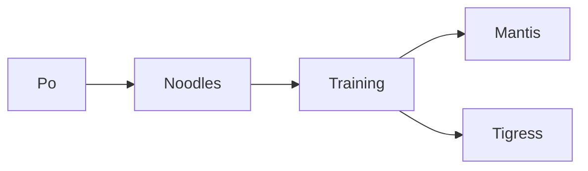
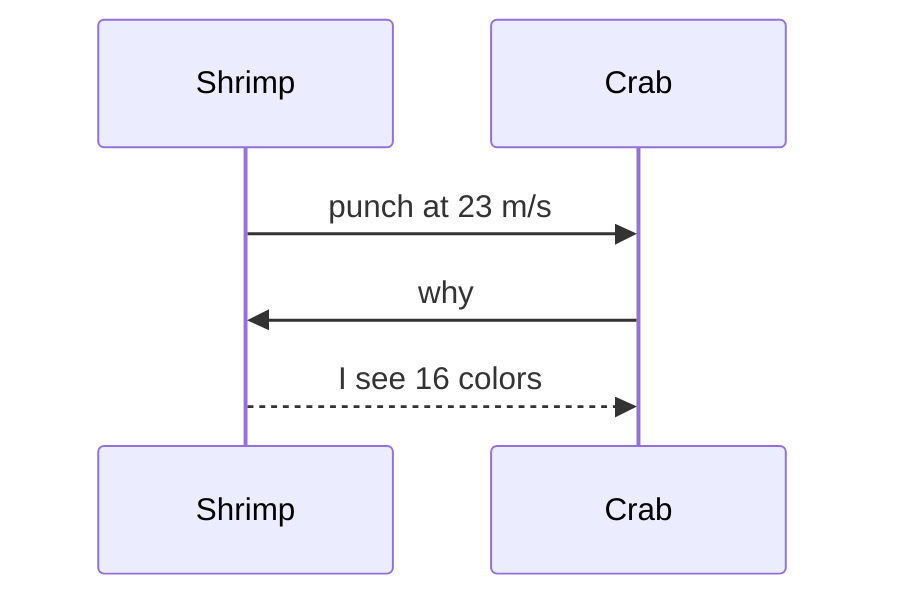
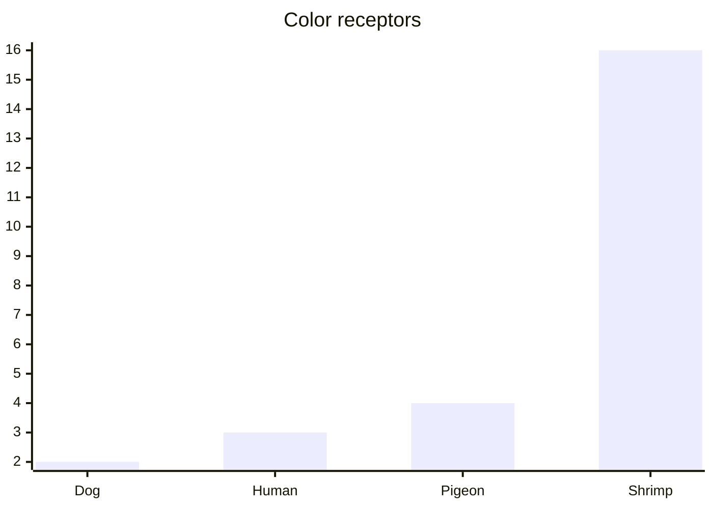
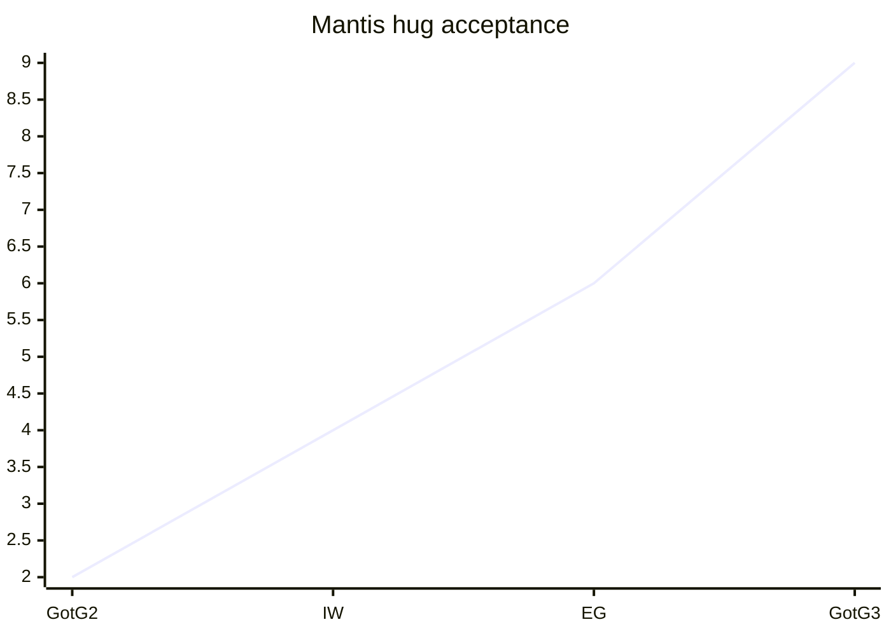

# prismantis

**Furious Five status:** Mantis cleared 3 dumplings in 6m 20s, kick power up 18% to 82 kicks/min. Notes in ~/jade-palace/training.md, scroll at https://github.com/NahumLitvin/prismantis

## Roster

| Mantis | Movie | Superpower | Size |
| :--- | :--- | :--- | ---: |
| Mantis | Kung Fu Panda | acupuncture kicks | 5cm |
| Mantis | Guardians of the Galaxy | empathy, awkward hugs | 168cm |
| mantis shrimp | real life | punches at 23 m/s | 10cm |

1. Wake up, stretch all 6 legs
2. Pray to the noodle gods
   - extra dumplings
   - no tofu









```ts
const master = "Shifu" // wise, short
export function train(student: string, dumplings = 3) {
  return `${student} ate ${dumplings} dumplings`
}
```

```bash
kungfu train --student "Po" --master shifu --dumplings 3 && echo "skadoosh"
```

> [!TIP]
> If `inner peace` returns 404, try `snacks` first.

> Mantis wisdom: small bug, big kick.

## עברית

**שלום חברים**, התוסף מצייר גם עברית עם מונחים באנגלית כמו `kubectl`, מספרים כמו 99.9% ו-250ms, וגם [קישור](https://github.com/NahumLitvin/prismantis).

- פרוסים ב-us-east ו-eu-west (שני אזורים)
- מחליפים ערכת נושא עם `/prismantis theme nord`

1. מתעוררים ומותחים את כל 6 הרגליים
2. מתפללים לאלי הנודלס

> עברית נקראת מימין לשמאל, גם בטרמינל בלי תמיכה בכיווניות

| לוחם | סרט | כוח על |
| :--- | :--- | :--- |
| מנטיס | קונג פו פנדה | בעיטות דיקור |
| שרימפ | מציאות | אגרוף ב-23 m/s |

```bash
ls -la # רשימת הקבצים
```
