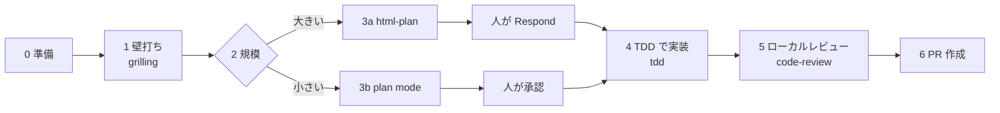

# sdlc-flow

チケットや依頼文を 1 つ渡すと、**壁打ち → 計画 → TDD で実装 → ローカルレビュー → PR 作成**までを順に進める Claude Code プラグイン（スキル）。
Anthropic の [AI-native SDLC playbook](https://academy.claude.com/courses/ai-native-sdlc-playbook) の考え方に沿い、
既存のスキル（Matt Pocock の skills・html-plan・pr-review-toolkit）を段階ごとに呼び分ける。

他のプラグインと違い、function hooks（Mods）ではなく、スキルと通常の command hook（関所）でできている。

## 使い方

```
/sdlc-flow PROJ-123
/sdlc-flow https://github.com/owner/repo/issues/45
/sdlc-flow 申込一覧を CSV でダウンロードできるようにしたい
/sdlc-flow                 ← 引数なし: 今のブランチの続きから再開
```

名前がほかのコマンドとぶつかるときは `/sdlc-flow:sdlc-flow` と打つ。

## 流れ



| 段階 | すること | 使うスキル | 人の入力 |
|---|---|---|---|
| 0 準備 | 依存の確認、プロジェクト設定の読み取り、チケットの取得、ブランチ作成 | — | 足りない設定だけ 1 回聞く |
| 1 壁打ち | 仕様を先に読み、残った疑問を質問攻めで詰めて Intent にまとめる。用語や設計判断が決まれば CONTEXT.md・ADR に残す | `mattpocock-skills:grilling`、`mattpocock-skills:domain-modeling` | 質問に答える（疑問が無ければ飛ばす） |
| 2 規模の判定 | 3 ファイル以上・画面・状態遷移・スキーマ・外部形式の変更なら html-plan、それ以外は plan mode | — | — |
| 3a html-plan | なぜ → 何を → どう → どこで の木と決定事項を 1 枚の HTML にまとめる（日本語） | `html-plan:html-plan` | ページの Respond で回答を貼る |
| 3b plan mode | 変更するファイル / 作業の順番 / リスク / 完了の証明 の 4 項目で計画する | — | 計画を承認する |
| 4 実装 | 失敗するテストを先に書き、チェックコマンドがすべて通るまで直す | `mattpocock-skills:tdd` | — |
| 5 レビュー | 既定ブランチとの差分を、規約と仕様（Intent・計画）の 2 軸で見る。例外処理やテストを触ったら専用エージェントも使う | `mattpocock-skills:code-review`、`pr-review-toolkit`（任意） | — |
| 6 PR 作成 | push して PR を作る。説明は Intent・確定した主張・決定事項・テスト結果・未解決事項から組み立てる | — | **確認なしで作る** |

`grill-with-docs`・`to-spec`・`to-tickets` は、スキル側でモデルからの呼び出しが禁止されている（`disable-model-invocation: true`）ため使わない。
代わりに、中身のほぼ同じ `grilling`＋`domain-modeling` と、html-plan / plan mode を使う。

## 入れ方

先に依存するプラグインを入れる。

```sh
# 必須
claude plugin marketplace add https://github.com/mattpocock/skills.git
claude plugin install mattpocock-skills@mattpocock
claude plugin marketplace add anthropics/claude-plugins-community
claude plugin install html-plan@claude-community

# 任意（5 のローカルレビューで使う）
claude plugin install pr-review-toolkit@claude-plugins-official

# 本体
claude plugin marketplace add y-ymmt/y-ymmt-harnesses
claude plugin install sdlc-flow@y-ymmt-harnesses
```

- html-plan は計画のページを仕上げるのに **node** を使う
- PR を作るのに **gh**（GitHub CLI）を使う

依存を `plugin.json` の `dependencies` に書いていないのは、別の marketplace のプラグインを自動で入れられないため
（入っていないと、このプラグインごと読み込まれなくなる）。代わりに、コマンドを打ったときに依存の有無を確かめ、足りなければ入れ方を案内する。

## プロジェクト側の設定

専用の設定ファイルは無い。プロジェクトによって文書の置き方は違うので、概要が書かれていることの多い入口の文書
（`README.md`・`CLAUDE.md`・`AGENTS.md`）から読み始め、そこから案内されている開発手順や規約の文書をたどる。
あわせて `.claude/rules/`・`REVIEW.md`・PR テンプレート・`Makefile` などのビルド定義・CI の定義も見て、次を読み取る
（詳しくは [references/project-settings.md](skills/sdlc-flow/references/project-settings.md)）。

| 項目 | 見つからないとき |
|---|---|
| 仕様の調べ方（仕様書の場所、調査用サブエージェント） | 聞く |
| チェックコマンド（テスト・lint・型検査・ビルド） | ビルド定義から候補を出して聞く |
| チケットの置き場所 | チケット番号だけ渡されたときに聞く |
| ブランチ命名・コミット書式・PR 書式 | 既定（`feature/<番号>-<説明>`、直近の `git log` の書き方、[PR の形](skills/sdlc-flow/references/pr-body.md)）を使う |
| レビュー観点・禁止事項 | 無いものとして進める |

最後の報告で、次の 2 種類を**そのプロジェクトで載せるのが適切な文書**への追記案として出す（文書は書き換えない）。

- 聞いたプロジェクト設定（書いておけば次から聞かれない）
- ローカルレビューで出た指摘のうち、文書にあれば防げたもの（規約の書き漏れ、繰り返しやすい間違い）

宛先は、同じ種類の情報が既に書かれている文書 → 入口の文書が案内している置き場所 → AI 向けの指示の置き場所（CLAUDE.md・AGENTS.md・`.claude/rules/`）
→ `README.md` の開発の節、の順に選ぶ。たとえばチェックコマンドが `docs/development.md` に並んでいるプロジェクトなら、そこへの追記案になる。

## 状態ファイル

段階ごとの結果を `<git ディレクトリ>/sdlc-flow/<ブランチ>/state.md` に書く。worktree ごとに分かれ、コミットされない。
中断しても、同じブランチで引数なしの `/sdlc-flow` を打てば続きから再開する。html-plan のページも同じフォルダに置く。
書式は [references/state-file.md](skills/sdlc-flow/references/state-file.md)。

## 確認を取らずにすること・しないこと

- **確認を取らずにする**: ブランチ作成、commit、push、PR 作成（コマンドを打ったことを許可とみなす）
- **しない**（hook で機械的に止めるもの）: 下の「関所の hook」を参照
- **しない**（スキルの指示で守らせるもの）:
  - 未コミットの変更の stash や破棄（止めて聞く）
  - テストの skip、lint や型検査の設定を緩めること、まだコミットしていないテストを書き換えて通すこと
  - プロジェクトの文書の書き換え、チケットへの書き込み（プロジェクトの文書が指示しているときだけ）
  - html-plan のページの Artifact への公開（頼まれたとき、またはプロジェクトの文書が求めるときだけ）

## 関所の hook

`hooks/guard.mjs`（PreToolUse）が、**sdlc-flow が動いているブランチでだけ**次を判定する。
「動いている」とは、今のブランチの状態ファイルがあり、`phase` が `done` 以外であること。それ以外のブランチや git の外では何もしない
（普段の作業で使う `--no-verify` などを止めないため）。

| 判定 | 対象 |
|---|---|
| deny | 既定ブランチへの push（`git push origin main`、`HEAD:main`、既定ブランチにいて refspec なし） |
| deny | force push（`--force`、`-f` を含む短いオプション、`--force-with-lease`、`--mirror`、`+` 付きの refspec） |
| deny | フックの迂回（commit・push・merge の `--no-verify`、commit の `-n`、`LEFTHOOK=0`・`HUSKY=0`、`-c core.hooksPath=…`） |
| ask | `phase` が `implement` のときに、HEAD にあるテストファイル（`tests/`・`test_*.py`・`*.test.ts`・`*_test.go` など）を Edit・Write すること |

- 既定ブランチは状態ファイルの `base`、無ければ `origin/HEAD` から決める
- まだコミットしていないテスト（TDD で書いたばかりのもの）は止めない。コミット済みのテストを書き換えるときだけ人に確かめる
- Bash の `sed` などでテストを書き換えるのは見分けられない（スキルの指示で守らせる）
- 環境の理由で pre-commit フックが通らないプロジェクトでは、commit のところで止まる。そのときはユーザーが別のターミナルで自分の手で commit し、
  引数なしの `/sdlc-flow` で続きから再開する
- 判定に失敗したとき（git が無い、入力が読めないなど）は何もせず、ツールの実行を止めない
- 動かすには **node** が要る

## 動作環境と確かめた範囲

| 項目 | 状態 | 補足 |
|---|---|---|
| `claude plugin validate` | 確認済み | 警告なしで通る |
| 関所の hook の判定 | 確認済み | `bun test plugins/sdlc-flow/tests/` の 50 件が通る。一時リポジトリに状態ファイルを置き、`guard.mjs` に入力を流して deny・ask・素通しを確かめた |
| Claude Code に読み込ませたときの hook の発火 | 確認済み | `claude -p --plugin-dir` で、状態ファイルのある作業ブランチから `git push origin main` を実行させ、hook の deny で止まった（2026-10-06）。ask の発火は未確認 |
| スキルとしての読み込み・起動 | 確認済み | `claude -p --plugin-dir` で `/sdlc-flow:sdlc-flow` を打ち、依存の確認を通って「状態ファイルが無いので何に取り組むか聞く」ところまで動いた（2026-10-06）。対話画面での起動は未確認 |
| 0〜7 を通した実行 | 未確認 | 実際のチケットで通しては試していない |
| html-plan を日本語で書かせること | たぶん動く | pack の ASD-STE100 検査は英語の正規表現による警告だけで、日本語では止まらないことをコードで確かめた |
| GitHub 以外（GitLab など）での PR 作成 | 未対応 | `gh` だけを使う |
